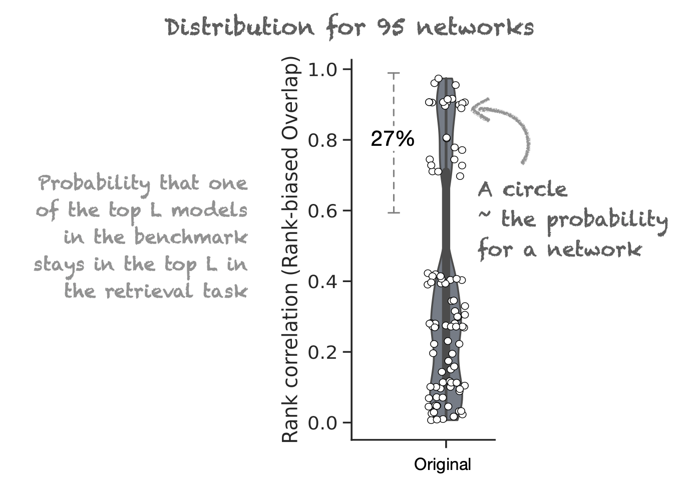
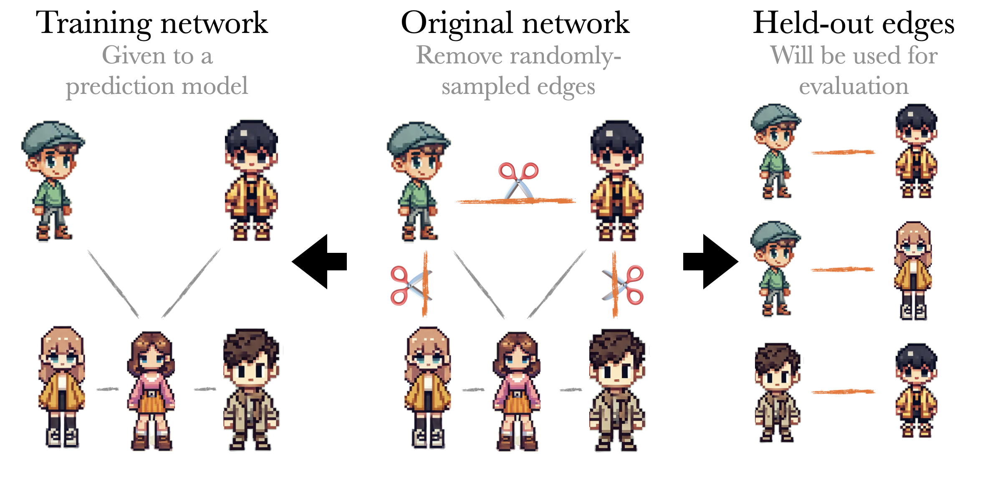
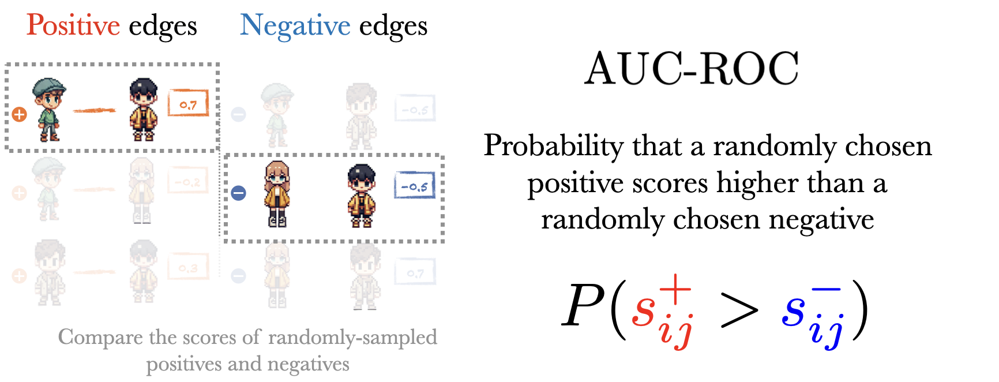
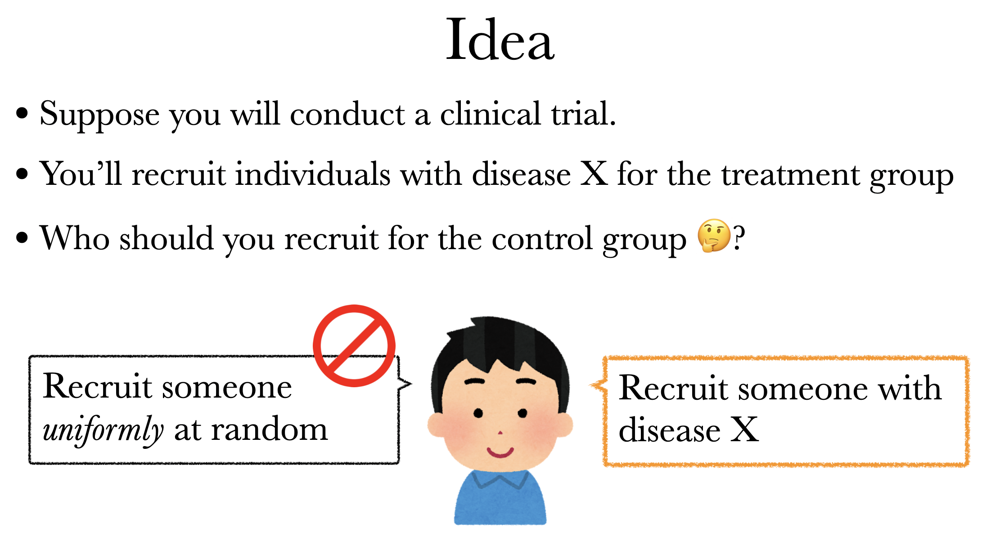

  <a class="btn" href="paper.pdf" target="_blank" style="color: white;">
    <i class="fas fa-file-pdf"></i>
    Paper (TBD)
  </a>
  <a class="btn" href="https://arxiv.org/abs/2405.14985" target="_blank" style="color: white;">
    <i class="fas fa-file-pdf"></i>
    Preprint
  </a>
  <a class="btn" href="https://github.com/skojaku/degree-corrected-link-prediction-benchmark" target="_blank" style="color: white;">
    <i class="fab fa-github"></i>
    GitHub
  </a>

  
  Sadamori Kojaku
  📧
  
  [skojaku@binghamton.edu](mailto:skojaku@binghamton.edu)
  
  {{ email_md | markdownify }}

## Summary

Link prediction benchmarks are widely used to evaluate models for recommendations and discovery. However, a subtle design flaw---uniform sampling of edges---introduces a **degree bias** that inflates performance scores for trivial heuristics. In a benchmark of 27 models across 95 real-world networks, we find that many models achieve excessively high benchmark performance by merely identifying high-degree nodes, not learning structural patterns. This post explains how this happens and outlines steps to fix the evaluation pipeline.

### ▶️ [Click here for frequently asked questions 🙋](#questions-and-answers)

## Benchmark scores can be misleading

### Disconnect between benchmark and real-world performance

Let us showcase the disconnect between benchmark scores and real-world effectiveness using 27 models across 95 real-world networks. We compared standard benchmark performance with a practical retrieval task (recommending the top K connections for a node, similar to social media friend suggestions). We found that over 60% of models that ranked at the top in standard benchmarks failed to be top performers in the retrieval task for about 70% of networks. This shows that high benchmark scores do not always mean good real-world performance.

### Benchmark ranks a crude model as the best

Let us showcase the issue by using __the preferential attachment method__, which predicts edges between two nodes \(i\) and \\(j\\) based on score
$$
\text{score}(i,j) = k_i k_j
$$
where \\(k_i\\) is the degree of node \\(i\\).
This is a crude prediction: it predicts edges solely based on node degrees, ignoring other highly useful network information (e.g., distance, common neighbors, etc.).

Despite its simplicity, the preferential attachment method performs surprisingly well on the benchmark👇:

(bold \\(\sim\\) benchmark performance)
- **0.94/1.00** on a all-science citation network
- **0.91/1.00** on the US patent citation network
- **0.93/1.00** on a protein interaction network
- **0.99/1.00** on a drug interaction network

Think about the citation network, for example.
The high performance of preferential attachment means that the model can predict citations based solely on a paper's popularity (references and citations count), completely ignoring content relevance. This contradicts our understanding of how researchers actually select citations --- based on relevance to their work, not just solely on popularity.

The preferential attachment method even outperforms the-state-of-the-art models like BUDDY for highly degree-heterogeneous networks (right). This occurs despite such advanced models incorporating detailed network structures such as neighborhood information and node distances in addition to degree information. It turns out that this is not because of the superiority of the preferential attachment method, but because it leverages a shortcut, as we will show in the next section.



<marimo-iframe data-height="600px" data-width="100%" data-show-code="false">
<pre>

import pandas as pd
import marimo as mo
import numpy as np

plot_data = pd.read_csv("https://raw.githubusercontent.com/skojaku/degree-corrected-link-prediction-benchmark/refs/heads/main/docs/static/assets/aucroc-agg.csv")

focal_method_dict = {
    "preferentialAttachment": "Preferential Attachment",
    "Buddy": "BUDDY",
    #"fineTunedGAT": "GAT",
    #"fineTunedGraphSAGE": "GraphSAGE",
    #"node2vec": "node2vec",
    #"resourceAllocation": "Resource Allocation",
    #"localPathIndex": "Local Path Index",
}

plot_data["model"] = plot_data["model"].map(
    lambda x: focal_method_dict[x] if x in focal_method_dict else x
)

method_button = mo.ui.radio(
    focal_method_dict.values(),
    value="Preferential Attachment",
    inline=True,
    label="🤖 **Link prediction method**",
)
#sampling_method_dict = {
#    "Standard (No degree correction)": "uniform",
#    #"Proposed (Degree correction)": "degreeBiased",
#    #"HearT": "heart"
#}
#sampling_button = mo.ui.radio(
#    sampling_method_dict.keys(),
#    value="Standard (No degree correction)",
#    inline=True,
#    label="🎯 **Benchmark type**",
#)
#mo.vstack([method_button, sampling_button])
#method_button

import altair as alt
# Assuming plot_data is your original dataframe
# Prepare the data similar to the original code
#focal_sampling_method = sampling_method_dict[sampling_button.value]
df = plot_data.query("negativeEdgeSampler == 'uniform'").copy()

# Create a new column to identify both focal methods
df["methodType"] = "Other"
df.loc[df["model"] == "Preferential Attachment", "methodType"] = "Preferential Attachment"
df.loc[df["model"] == "BUDDY", "methodType"] = "BUDDY"

df = df.sort_values("lognorm_sigma")
df["data_code"] = np.arange(df.shape[0])
df["data_code"] = 100 * df["data_code"] / df["data_code"].nunique()

# Create tooltip with dataname and model name
tooltip = [
    alt.Tooltip("data:N", title="Dataset"),
    alt.Tooltip("model:N", title="Method"),
    alt.Tooltip("score:Q", title="AUC-ROC", format=".3f"),
]

# Common x and y axis definitions
x_axis = alt.X(
    "data_code:Q", title="Networks (ordered by degree heterogeneity)", scale=alt.Scale(domain=[-1, 101])
)
y_axis = alt.Y("score:Q", title="AUC-ROC", scale=alt.Scale(domain=[0.2, 1.01]))

# Create a color scale for method types
color_scale = alt.Scale(
    domain=["Preferential Attachment", "BUDDY", "Other"],
    range=["#FF7F0E", "#27344d", "#d3d3d3"]
)

# Base chart with color encoding for legend
base = alt.Chart(df).encode(
    x=x_axis,
    y=y_axis,
    color=alt.Color("methodType:N", scale=color_scale, legend=alt.Legend(
        orient="top",
        title="Method Types",
        titleFontSize=14,
        labelFontSize=12,
        titleAlign="center",
        titleAnchor="middle",
        direction="horizontal",
        legendX=400,
    )),
    tooltip=tooltip
)

# For other methods (background points)
other_points = base.transform_filter(
    alt.datum.methodType == "Other"
).mark_circle(size=40)

# For BUDDY points - using square shape
buddy_points = base.transform_filter(
    alt.datum.methodType == "BUDDY"
).mark_circle(size=50, stroke="black", strokeWidth=0.4)

# For Preferential Attachment points
pa_points = base.transform_filter(
    alt.datum.methodType == "Preferential Attachment"
).mark_circle(size=100, stroke="black", strokeWidth=1)

# Layer the charts
chart = (
    (other_points + buddy_points + pa_points)
    .properties(width=400, height=400)
    .configure_axis(labelFontSize=16, titleFontSize=16)
    .configure_view(strokeWidth=0)
)

# Display the chart
chart

</pre>
</marimo-iframe>


## Implicit degree bias

### How the benchmark works

Standard benchmarks for testing link prediction algorithms follow a simple process: take a complete network, randomly remove some edges to create a test set, and train models on the remaining network.
The link prediction model then scores both the held-out edges and randomly sampled non-existent edges.

Performance is measured using AUC-ROC, which shows how well the model distinguishes between real missing edges and random non-edges. A higher score means the model is better at ranking actual connections above non-connections.

### A mismatch

The issue of the benchmark stems from *sampling* of the connected and non-connected node pairs. The connected node pairs are sampled uniformly at random **from edges**. On the other hand, the non-connected node pairs are sampled uniformly at random from **nodes**. Since the high-degree nodes appear more frequently in the edge set, they tend to be sampled more frequently as connected node pairs.

This creates a mismatch between the positive and negative edges in terms of the node degrees.

This mismatch makes the degree-based heuristics work so well: we can distinguish easily by just looking at the degree of the nodes. We call this phenomenon the **degree bias** of the benchmark. This bias excessively inflates the performance of the degree-based heuristics like the preferential attachment method, more than what they would achieve in real-world tasks.

### A remedy

Think of link prediction benchmarks like clinical trials. In a proper clinical trial, we wouldn't compare patients with a disease (treatment group) to random people (control group) - we'd compare them to other patients with the same disease. Similarly, in link prediction, we shouldn't compare positive edges (treatment group) to randomly sampled negative edges (control group). This leads to inaccurate effectiveness of a link prediction model (drug).
Rather, we should sample negative edges with the same degree distribution as the positive edges.

To this end, we propose the **degree-corrected benchmark**, which samples negative edges that have the same degree distribution as the positive edges. We do this by creating a list of node set with duplicates proportional to the node degrees (i.e., node with degree \\(k\\) appears \\(k\\) times in the list). Then we sample negative edges by uniformly sampling two nodes from this list. This way, the negative edges have the same degree distribution as the positive edges.

## Results: Improving the alignment between benchmarks and real-world tasks

The degree-corrected benchmark improves the alignment between benchmarks and real-world tasks, as is evidenced by more networks with higher RBO scores than the standard benchmark. Namely, the top-performing models in the degree-corrected benchmark are more likely to be the top-performing models in the real-world tasks.

## Improving representation-learning of networks

The link prediction benchmark is often used as a unsupervised training objective for representation-learning of networks.
We test the utility of the degree-corrected benchmark as a training objective by training graph neural networks (GNNs).
As a quality metric of the learned representations, we focus on whether the embeddings learned by the GNNs encode community structure of networks, as communities are fundamental structures that inform many tasks, including link prediction, node classification, dynamics, and more.
We found that when correcting the degree-bias, the community detection accuracy increases for all the GNNs tested. For more details, please refer to our paper.

---

## Questions and Answers

**Q: Does the degree-corrected benchmark remove all predictive power of node degree?**

A: No. If node degree is genuinely predictive of edge formation in the real network (e.g., in rich-club or preferential attachment graphs), degree-based methods will still perform well under the degree-corrected benchmark. The correction only removes the artificial bias introduced by the sampling procedure, not the true signal present in the data. (See biokg_drug discussed in the paper.)

**Q: Does the degree-corrected benchmark introduce new biases, for example against low-degree nodes?**

A: No, the degree-corrected benchmark does not introduce unfair bias against low-degree nodes. In fact, it restores balance to the types of comparisons made between positive and negative edges. In link prediction evaluation, the model's performance is determined by how well it distinguishes positive from negative edges, and these comparisons can be grouped into four types: (1) high-degree positive vs. high-degree negative, (2) high-degree positive vs. low-degree negative, (3) low-degree positive vs. high-degree negative, and (4) low-degree positive vs. low-degree negative.

In the standard benchmark, there is a strong imbalance: most comparisons are between high-degree positive edges and low-degree negative edges. In degree-heterogeneous networks, over 70% of the AUC-ROC score comes from these 'easy' cases, where degree alone is a strong discriminator. This means the benchmark over-represents situations where high-degree nodes are positives and low-degree nodes are negatives, making it unfairly easy for degree-based methods and not representative of all node types.

The degree-corrected benchmark, by matching the degree distributions of positive and negative edges, achieves near-perfect parity among all four types of comparisons. This ensures that the model is evaluated fairly across the full spectrum of node degrees, including low-degree nodes. Empirical results show that models trained and evaluated with degree-corrected sampling perform better on tasks that depend on all nodes, not just high-degree ones. (See Supplementary Information Section 3.2 and "Improving representation-learning of networks" above.)

**Q: How does this benchmark relate to other biases, like distance bias?**

A: Degree bias is more fundamental than distance bias, because node degree influences many other structural properties, including shortest path distances. Our results show that correcting for degree bias also reduces distance bias, but the reverse is not necessarily true. Benchmarks that only address distance bias may still be vulnerable to degree-based shortcuts. (See Discussion and comparison with HeaRT benchmark in the paper.)

**Q: Is the issue limited to small networks?**

A: No. The degree bias is present in any non-regular network, regardless of the size. We have observed that the degree bias tends to be more severe for larger networks, as the degree-heterogeneity tends to be higher for larger networks (See the results for OGB and large-scale network experiments.)

**Q: Why not just use ranking-based metrics like Hits@K or MRR?**

A: The degree bias arises in the benchmark data, which is a problem independent of the choice of evaluation metrics. Indeed, perhaps some metrics are less sensitive to the degree bias, but they can be still affected by it.
In fact, we have observed qualitatively similar results for Hits@K and MRR as an alternative to AUC-ROC, i.e., degree-based methods still perform well on these metrics when the degree distribution is heterogeneous (See Supplementary Information.)

**Q: How does this work relate to OGB and other recent benchmarks?**

A: Our analysis shows that degree bias is present in many popular benchmarks, including those in the Open Graph Benchmark (OGB) suite. The degree-corrected benchmark can be used to improve the fairness and reliability of these evaluations. (See OGB graphs and Discussion section.)

**Q: Why do we bother with benchmarks? Why not just use retrieval tasks?**

A: Link prediction benchmarks offer a more efficient evaluation method than retrieval tasks. While retrieval tasks require searching across all network nodes—computationally expensive for large networks—benchmarks use pre-sampled positive and negative edges for classification, making model training much faster. In practice, real-world retrieval systems typically use a two-step approach: first, a computationally efficient retriever model (often trained on link prediction benchmarks) generates candidate nodes, then a more sophisticated model ranks these candidates. Therefore, even for retrieval applications, benchmarks remain essential to the training and evaluation pipeline.

---

## Contact

- 📧 [skojaku@binghamton.edu](mailto:skojaku@binghamton.edu)
- 🧠 [skojaku.github.io](https://skojaku.github.io)

---

  <h2>Team</h2>
  

    

      
      <a href="https://rachithaiyappa.github.io/" target="_blank">
Rachith Aiyappa
</a>
    

    

      
      <a href="https://xin-wang-kr.github.io/" target="_blank">
Xin (Vision) Wang
</a>
    

    

      
      <a href="https://munjungkim.github.io/" target="_blank">
Munjung Kim
</a>
    

    

      
      <a href="https://www.ozgurcanseckin.com/" target="_blank">
Ozgur Can Seckin
</a>
    

    

      
      <a href="https://jisungyoon.github.io/" target="_blank">
Jisung Yoon
</a>
    

    

      
      <a href="https://yongyeol.com/" target="_blank">
Yong-Yeol Ahn
</a>
    

    

      
      <a href="https://skojaku.github.io/" target="_blank">
Sadamori Kojaku
</a>
    

  

