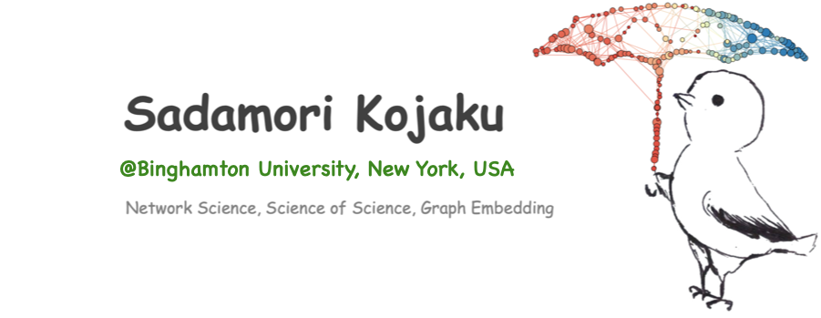
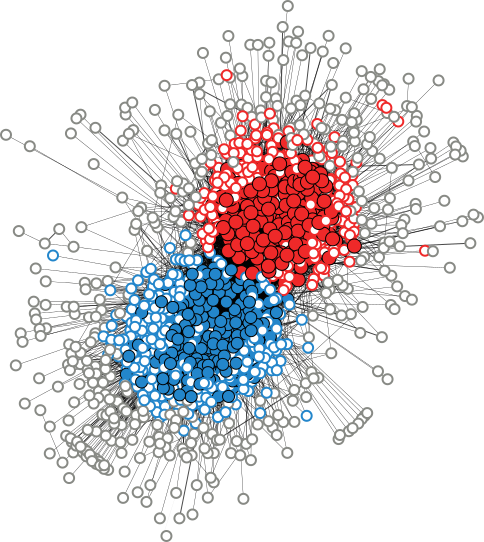
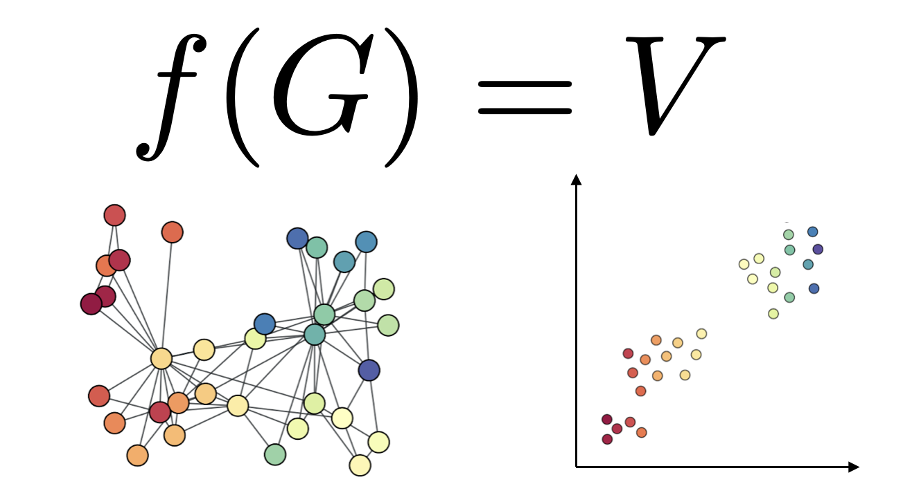

Hi 👋, I am Sadamori Kojaku. I'm a network scientist and computer scientist working at the intersection of Network Science and Machine Learning. I am a postdoctoral researcher working with Dr.~Yong-Yeol Ahn at Indiana University (IU), Bloomington. I am a former postdoc of Dr. Naoki Masuda.

- [About me](./attachments/docs/../../docs/about_me/About_me.md)
- [CV](./attachments/docs/cv/cv-skojaku.pdf)
- [Publications](./docs/publications/Publications.md)
- [My digital garden (my notes and thoughts in process)](https://spontaneous-chebakia-5b4975.netlify.app/)
- Code
    - [Github](https://github.com/skojaku)
    - [Code list](https://spontaneous-chebakia-5b4975.netlify.app/tips/coding/code/)

# Research

Data is the "oil" that fuels our exploitation of the physical world, human behaviors, and our society. And data is *crude*; it is often incomplete, noisy, and biased. Algorithms trained on crude data can generate false claims and make biased decisions. For instance, some biased AI systems are more likely to associate female names with family-related words than career-related words, and flag Black people as twice more likely as Whites to be at a higher risk of future crimes (Bolukbasi et al. 2016; Angwin et al. 2016). This type of systemic risk calls for an urgent need for understanding and creating fair AI systems.

Fairness and faithfulness of algorithms are becoming increasingly important in text and image processing. Yet, another prevalent data type---networks---has received far less attention. Networks are a simple and powerful representation that abstracts out various complex systems including social networks, banking networks, the Internet, food webs, and brains. The structure of networks is critical; for example, it underpins the spreading of ideas, misinformation, and disease over social networks. And, network data often reflect human biases; for instance, social networks often exhibit strong homophily w.r.t. race, gender, religions, and profession, which make their way into algorithms for recommendation and credit referencing and may influence critical human decisions such as promotion and law enforcement. Despite the universality and critical use of network data, the faithfulness and fairness of algorithms for network data have received much less attention than they deserve.

My research aims to provide a fundamental basis for faithful and fairness-aware machine learning for networks. This basis is *graph representation learning*, or *embedding*, which embeds a network into a vector space. Graph embedding enables direct application of powerful machine learning for graph data, transforming the way we analyze, understand, and exploit graph data for applications. The geometry of embedding is a reflection of network structure and human biases. By understanding how human biases appear and by controlling it, I aim to create faithful and fairness aware representation of network data, which may potentially lead to major systematic improvements in a variety of applications. Towards this goal, I focus on fundamental understanding of how they function, which enables us to assess and leverage their strength, and "distill" useful insights from rich but crude network data.

